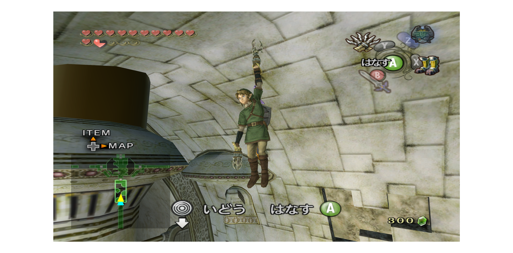
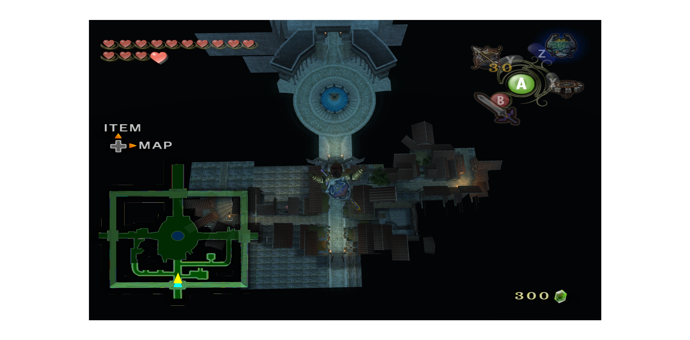

# トワイライトプリンセス 日本版 リバースエンジニアリングプロジェクト

Nintendo GameCube版『ゼルダの伝説 トワイライトプリンセス』日本版（GZ2J01）の解析・Geckoコード開発プロジェクトです。

---

## このプロジェクトについて

海外版（GZ2E01）のGeckoコードは数多く公開されていますが、日本版（GZ2J01）の情報は非常に少なく、多くのコードはそのまま利用できません。

そこで本プロジェクトでは、日本版の実行コードを解析し、Geckoコードを自作・検証しています。

本リポジトリには、以下のようなコードを掲載しています。

- 日本版（GZ2J01）向けに新規解析して作成したコード
- 海外版コードを参考に、日本版へ移植・調整したコード
- 動作検証・改良を行ったコード

各コードについては、READMEやドキュメント内で由来や開発状況を記載しています。
---

## 開発環境

- ゲーム
  - ゼルダの伝説 トワイライトプリンセス
  - Nintendo GameCube 日本版
  - Game ID：GZ2J01

- エミュレータ
  - Dolphin Emulator

- 使用ツール
  - Dolphin Memory Engine
  - Gecko Code
  - PowerPC逆アセンブル
  - Ghidra
    
## Development

CueBridge was developed using:

- Python 3.12
- Visual Studio Code
- Git & GitHub
- Ghidra (used to analyze parts of the rekordbox binary/database behavior)
- PyInstaller (Windows executable packaging)

---

# 現在公開しているコード

## Flying Super Spinner（Prototype）

スピナーの挙動を書き換え、通常では不可能な空中移動を実現する試作コードです。

### 確認済み

- スピナーの無重力化
- 空中での飛行
- 地形を越えた移動

### 未完成

- Zボタンによる上昇
- Rボタンによる下降

ボタンによる上下操作の処理は実装済みですが、現時点では正常に動作しません。

## 🪝 Clawshot Anywhere Long Range

クローショットの有効射程を約2倍に拡張するコードです。

通常では届かない距離にもクローショットを使用できるようになります。

### 確認済み

- [x] クローショットの有効射程を約2倍に拡張
- [x] 通常では届かない場所へ使用可能
- [x] 通常では刺さらない場所にも刺さる
- [x] 日本版（GZ2J01）で動作確認

## 🌙 Moon Jump (R + A)

海外版の既存コードを参考に、日本版（GZ2J01）へ移植・調整し、動作確認を行ったコードです。

### 確認済み

- [x] R + Aでムーンジャンプ
- [x] 日本版（GZ2J01）で動作確認

### コード

`codes/Flying-Super-Spinner.ini`
`codes/Clawshot-Anywhere-Long-Range.ini`
`codes/moon-jump-r-a.ini`

---

## 導入方法

1. Dolphinを起動
2. ゲームを右クリック
3. プロパティ
4. Geckoコード
5. 「新しいコードを追加」
6. コードを貼り付ける
7. チェックを入れてゲーム起動

---

# 開発ログ

## 2026-07

- スピナー関連処理の解析開始
- 重力パラメータを特定
- Flying Super Spinner（試作版）を作成
- ボタン入力による上下移動を実装中

---

# 今後の予定

- ムーンジャンプ
- フリーカメラ
- 座標表示
- デバッグ関連コード
- 日本版専用コードの追加

---

# 注意事項

- 日本版（GZ2J01）専用です。
- 海外版では動作しません。
- セーブデータのバックアップを推奨します。
- 実機では未確認です。
- 使用は自己責任でお願いします。

---

# 権利表記

本リポジトリにはゲームデータ、ディスクイメージ、セーブデータ等は含まれていません。

『ゼルダの伝説』および関連する著作物の権利は任天堂株式会社に帰属します。
